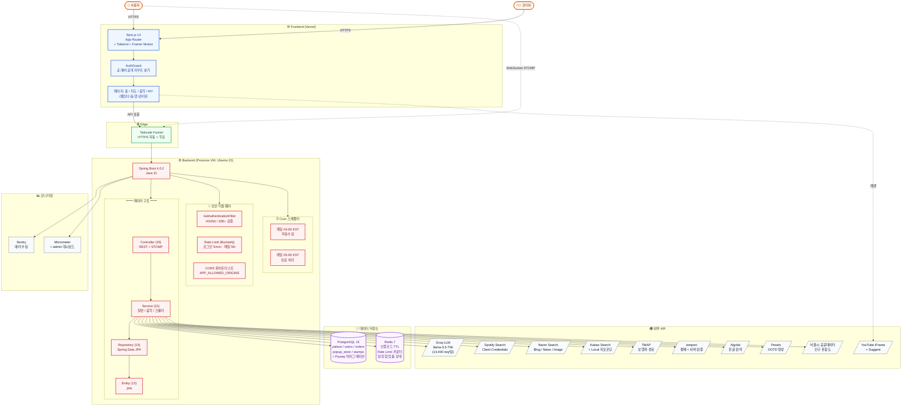
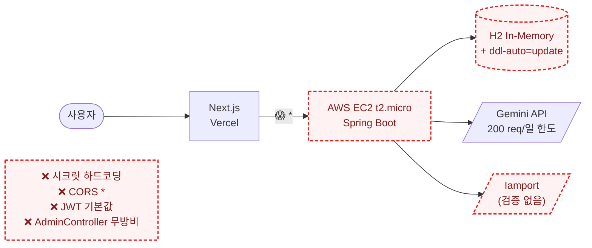
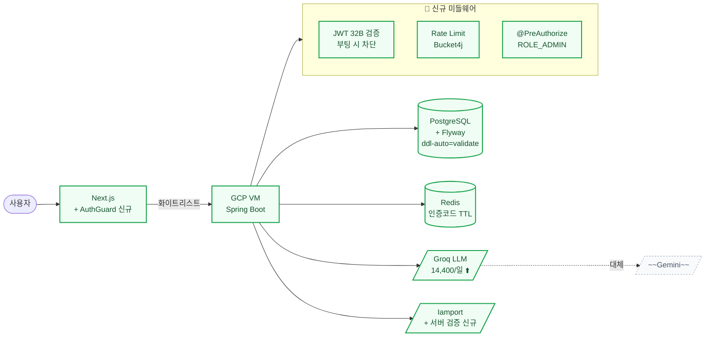
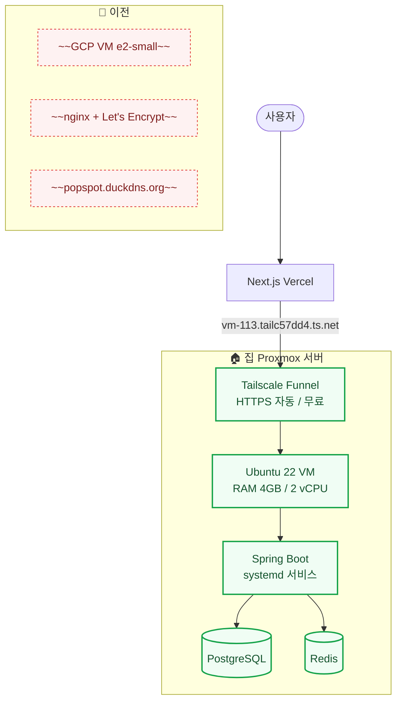
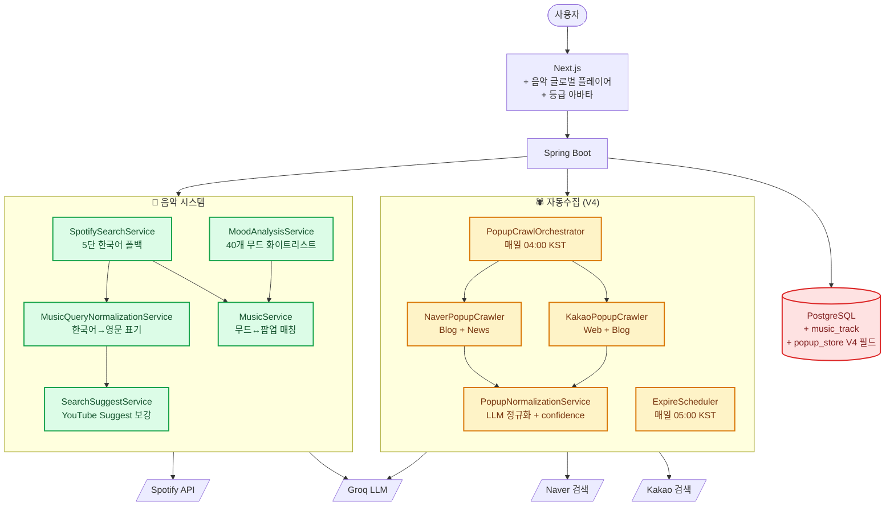
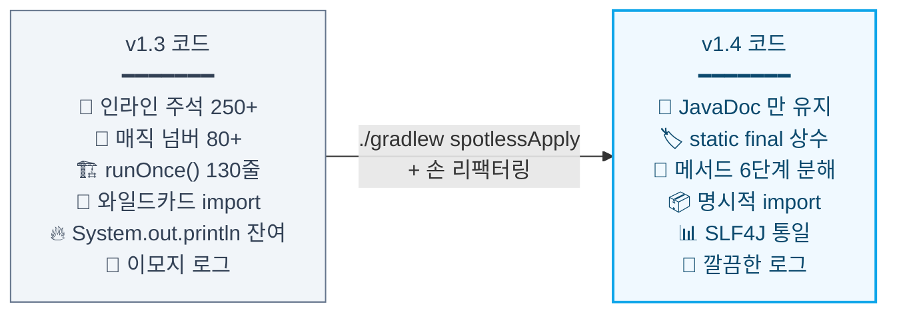
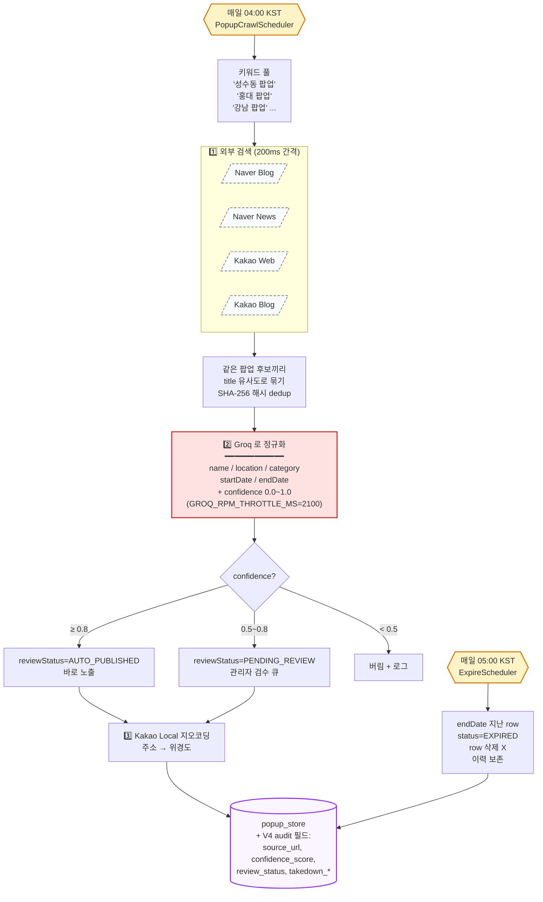

# POP-SPOT — Architecture & Evolution

성수동 팝업스토어를 검색하고, 자동으로 수집하고, 사용자가 듣는 노래에 맞는 팝업을 추천해주는 사이드 프로젝트.

학교 끝나고 카페에서 짬짬이 만들었다. 2024년 가을부터 시작해서 지금(v1.4)까지 계속 굴리는 중.

> 사이트: https://popspot.duckdns.org (시놀로지 NAS 로 이전 중이라 잠깐 끊길 수 있음)

---

## Tech Stack

[](https://skillicons.dev)

<p align="left">
  
  
  
  
  
  
  
  
  
  
</p>

---

## 현재 아키텍처 (v1.4, 2026-05)



복잡해 보이지만 핵심은 3개:
1. **PostgreSQL** — 영구 데이터 (팝업, 유저, 주문, 스탬프)
2. **Redis** — 휘발성 / TTL 필요한 것 (인증코드, Rate Limit, 일정 협업 룸)
3. **Groq LLM** — 한국어 정규화, 무드 분석, 코스 추천 — 다 여기로

---

## 버전별 진화

처음엔 학교 캡스톤 과제로 만든 모놀리식 한 덩어리였다. 지금까지 5번의 큰 변곡점이 있었음.

### 📍 v1.0 — 초기 모놀리식 (2024 가을)

> "그냥 돌아가기만 하자" 단계. 학교 캡스톤 과제.




**문제점 (지금 보면 끔찍한 것들)**:
- `application.properties` 에 DB 비번 / JWT 시크릿 / 결제 키 하드코딩
- `CORS *` 로 모든 origin 허용
- `AdminController` 에 권한 체크 없음 → URL 만 알면 누구나 admin
- 결제 시 클라이언트가 보낸 amount 그대로 믿음
- `ddl-auto=update` 운영 → 컬럼 한 번 바꾸면 DB 폭망 가능

---

### 📍 v1.1 — 보안 감사 + LLM 갈아타기 (2025 봄)

> "이거 운영하면 큰일나겠다" 단계. OWASP Top 10 다 적용.




**핵심 변경 (백엔드 §1.1~§1.13)**:
- 🔐 시크릿 환경변수 분리 + `.env.example` + systemd `EnvironmentFile=`
- 🔐 Iamport **서버 검증** 추가 (금액 조작 시 자동 환불 + SecurityException)
- 🔐 JWT 시크릿 32바이트 미만이면 부팅 자체 차단
- 🔐 CORS `APP_ALLOWED_ORIGINS` 화이트리스트
- 🔐 AdminController + Actuator → `hasRole('ADMIN')` 이중 방어
- 🔐 Rate Limit (Bucket4j): 로그인 5회/분, 메일 5회/시간
- 🔐 `System.out.println` PII 노출 → SLF4J 전환
- 🔐 `ddl-auto=update` → `validate` + Flyway 마이그레이션
- 🤖 **Gemini → Groq** 마이그레이션 (200/일 → 14,400/일 약 72배)
- 🎨 인트로 페이지 + AuthGuard 공개 경로

---

### 📍 v1.2 — 인프라 대이주 (2025 5월)

> "프리티어 끝났고 GCP 도 비싸". 집에 있는 Proxmox VM 으로 통째로 이전.




**핵심 변경 (§6 마이그레이션 실행 기록)**:
- ☁️→🏠 GCP VM → Proxmox VM (월 비용 0원)
- 🔒 nginx + certbot → **Tailscale Funnel** (인증서 갱신 자동, 포트포워딩 불필요)
- 🌐 도메인 `popspot.duckdns.org` → `vm-113.tailc57dd4.ts.net`
- 📦 `deploy.sh` 직접 작성 (jar 빌드 → systemd restart)
- 🐛 10단계 마이그레이션 + 19가지 트러블슈팅 (LazyInit, 한국어 검색, application-prod 우선순위 함정 등)

---

### 📍 v1.3 — 음악 시스템 + 자동수집 (2026 1~4월)

> 이게 제일 재미있게 만든 부분. AI 가 노래 듣고 팝업 추천해주는 거.




**핵심 변경 (§7 음악, §1.18~ 자동수집)**:
- 🎵 **A. 영구 캐시** — 한 번 분석한 곡은 외부 API 호출 X
- 🎵 **B. Spotify 마이그레이션** — iTunes / YouTube Data API 한도 문제로
- 🎵 **C. 글로벌 음악 플레이어** — 미니/풀 모드, Provider 패턴
- 🎵 **D. /music 페이지 폐기** → 홈 탭으로 통합 (UX 단순화)
- 🎵 **E. 카테고리/무드 라이브러리** + 추천 자동 재생
- 🎵 **F. 음악 → 팝업 역추천** (재생 중 추천 표시)
- 🎵 **G. YouTube IFrame 영상 노출** (약관 III.E.4.b 준수)
- 🕷️ **자동수집 V4** — Naver/Kakao + LLM 정규화 + confidence 분기
- 🕷️ takedown 신고 + 출처 표시 (저작권법 §35의5)
- 🏆 **등급 시스템** (BEGINNER / HUNTER / MASTER) + 아바타 테두리
- 🌙 다크모드 텍스트 가독성 (라임/크림 배경)

---

### 📍 v1.4 — Clean Code 리팩터링 (현재, 2026-05-14)

> "기능 추가 한참 했으니 이제 정리 좀". Robert Martin Clean Code 적용.




**7 Wave 일괄 정리**:

| Wave | 영역 | 파일 수 | 대표 변화 |
|---|---|---|---|
| 1 | `build.gradle` | 1 | Spotless 플러그인 추가 |
| 2 | 음악 서비스 | 7 | `searchKoreanWithFallback` 등 5단 분해 |
| 3 | 자동수집 크롤러 | 8 | `runOnce()` 130줄 → 6 stage |
| 4 | Controller | 25 | Redis 키 prefix 상수, 헬퍼 분리 |
| 5 | 일반 Service | 16 | `OrderService` 결제 검증 7단계 |
| 6 | Entity | 6 | `User`, `PopupStore` JavaDoc 정리 |
| 7 | Config/Exception | 9 | `SecurityConfig` PUBLIC_PATHS 상수 |

**원칙**:
- 의미 있는 이름 (`t`/`s` → `targetIds`/`voterLogKey`)
- 작은 함수 (한 메서드 한 가지 일)
- 매직 넘버 → `static final` 상수
- JavaDoc 만 (왜 그렇게 만들었나)
- 데이터 캡슐화 (Map → record / 내부 class)
- 빨리 실패 (입력 검증을 메서드 초반에)

> **외부 동작은 100% 동일** — 회귀 위험 최소화. API 경로, DB 스키마, Redis 키 모두 그대로.

---

## 자동수집 V4 — 자세히



**왜 만들었나?**
손으로 30개 직접 넣다가 미쳐버릴 것 같아서. 이제 admin 페이지에서 승인 버튼만 누르면 됨.

**저작권 회피 전략**:
- 본문 스크래핑 X — 검색 API 가 주는 title/description/link 만 사용
- 출처 URL + 출처명 필수 표시 (저작권법 §35의5 공정이용)
- Takedown 요청 시 24시간 내 노출 차단

---

## 음악 매칭 — 자세히

```mermaid
flowchart LR
    classDef cache fill:#dcfce7,stroke:#16a34a
    classDef ai fill:#fee2e2,stroke:#dc2626
    classDef api fill:#f8fafc,stroke:#475569,stroke-dasharray:5 3

    Click([🎵 곡 클릭]) --> Cache{이미 분석한 곡?}:::cache
    Cache -->|YES, music_track 에 있음| DB[(music_track 캐시)]:::cache
    DB --> Match

    Cache -->|NO| Spotify[/Spotify Search<br/>Client Credentials/]:::api
    Spotify --> Found1{한국 곡<br/>찾았나?}
    Found1 -->|NO| AI["Groq AI<br/>아이유 → IU<br/>좋은날 → Good Day"]:::ai
    AI --> Spotify

    Found1 -->|여전히 NO| Suggest[/YouTube Suggest<br/>후보 보강/]:::api
    Suggest --> Spotify

    Found1 -->|YES| Mood["Groq AI<br/>무드 분석<br/>━━━━━━━<br/>40개 화이트리스트:<br/>차분 / 신남 / 감성<br/>댄스 / 록 / 발라드 ..."]:::ai

    Mood --> Match["MusicService.matchPopups<br/>━━━━━━━━━━━<br/>무드 → 팝업 카테고리 매핑<br/>FASHION / FOOD / CULTURE<br/>CHARACTER / BEAUTY / TECH"]

    Match --> Show([🎁 추천 팝업 5개])

    Show -.재생.-> YT[/YouTube IFrame<br/>(영상 화면 표시 필수)/]:::api
```

처음엔 YouTube Data API 만 썼는데 일일 쿼터(10,000 unit)가 너무 작아서 Spotify 로 갈아탔다.
재생은 YouTube IFrame 으로 — 약관(III.E.4.b) 때문에 영상이 화면에 보여야 해서 미니플레이어에 작게라도 노출.

---

## 폴더 구조 (백엔드)

```
popspot-backend/
├── src/main/java/com/example/popspotbackend/
│   ├── controller/        # 25개. REST + WebSocket
│   ├── service/
│   │   ├── (root)         # 일반 비즈니스 로직 16개
│   │   ├── music/         # 음악 매칭 7개
│   │   └── crawler/       # 자동수집 8개
│   ├── entity/            # JPA 엔티티 13개
│   ├── repository/        # Spring Data JPA (15)
│   ├── dto/               # 요청/응답 DTO (~25)
│   ├── config/            # Security, WebSocket, RateLimit, AI (9)
│   └── exception/         # GlobalExceptionHandler
├── src/main/resources/
│   ├── application.properties           # 공통
│   ├── application-prod.properties      # 운영 오버라이드
│   └── db/migration/                    # Flyway V1__init.sql ...
└── build.gradle           # Spotless googleJavaFormat aosp
```

---

## 트러블슈팅 (재밌었던 것만)

**1. LazyInitializationException 이 갑자기 터짐 (v1.2 운영 중)**
배포하고 한참 뒤에 갑자기 N+1 에러. PopupStore 의 images 가 EAGER 였는데 트랜잭션 밖에서 lazy 처럼 동작해서 그랬다. LAZY 로 바꾸고 fetch join 으로 해결.

**2. PostgreSQL 한글 검색 ILIKE 너무 느림**
사용자가 100명 정도 됐을 때 검색이 3초 걸림. Algolia 붙이고 200ms 로 단축.

**3. Spotify search 가 한국 곡 못 찾음**
"아이유 좋은날" 검색하면 아무것도 안 나옴. Groq 으로 영문 표기 변환 한 단계 추가 → "IU good day" → 잘 나옴.

**4. application-prod.properties 외부 파일 우선순위 함정 (v1.2)**
운영 배포했는데 환경변수가 안 먹힘. 알고 보니 외부 파일이 환경변수보다 우선순위가 낮아서. 파일 자체를 안 두고 환경변수만 쓰는 걸로 변경.

**5. Gemini API 키 노출 → Google 자동 차단 (v1.1)**
실수로 키를 GitHub 에 commit. Google 이 30분 만에 자동 비활성화. 그때부터 시크릿 스캔 GitHub Action 추가.

---

## 만들면서 배운 것

- 사이드 프로젝트는 무조건 작게 시작해야 한다. 처음에 "팝업 + 동행 + 결제 + 채팅 + 게임 + 음악" 다 넣겠다고 한 거 후회 중
- 외부 API 는 무조건 graceful degradation. 키 없거나 한도 초과해도 부팅 자체는 되게.
- 한국어 검색은 영어와 완전히 다른 짐승이다.
- 결제 모듈은 절대 클라이언트 값 믿지 말 것.
- 보안은 처음부터 하자. 나중에 끼워 넣는 거 진심 힘들다.
- 클린 코드는 마지막에 한 번에 정리하기보다 매번 조금씩 하는 게 낫다 (v1.4 작업할 때 느낌).

---

## 다음 단계 (TODO)

- [ ] iOS / Android 네이티브 (Capacitor 로 wrap 할까 고민 중)
- [ ] 팝업 이미지 OCR → 자동수집 정확도 더 올리기
- [ ] AI 어시스턴트 — 사용자 취향 학습해서 큐레이션
- [ ] 결제 부분 다른 PG 도 추가 (KG이니시스 등)
- [ ] 시놀로지 NAS 이전 마무리 (백엔드만 옮기면 됨)
- [ ] 단위 테스트 커버리지 50% 이상 (지금 10% 정도)

---

만든 사람: **동현** (학교 동기 한섭이가 디자인 도와줌)
연락처: 깃허브 이슈로

처음엔 그냥 학교 과제용이었는데 어쩌다 보니 여기까지 왔다.
